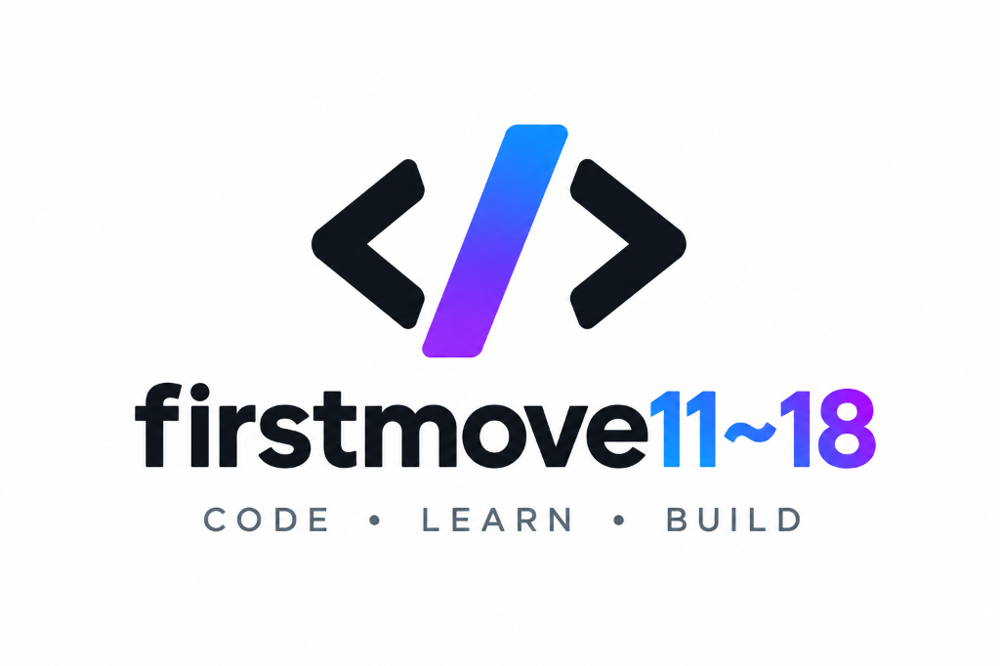

<p align="center">
  
</p>

<h1 align="center">First Move (11~18)</h1>

<p align="center">
  <strong>CODE • LEARN • BUILD</strong><br />
  <em>Next-Generation Interactive Educational Technology Platform</em>
</p>

<p align="center">
  
  
  
  
  
  
</p>

<p align="center">
  <a href="https://first-move-11-18.vercel.app"><strong>🔗 Live Deployment: https://first-move-11-18.vercel.app</strong></a>
</p>

---

## 🌟 About First Move (11~18)

**First Move (11~18)** is a modern educational technology learning ecosystem designed to guide learners from absolute beginner foundations to industry-level mastery. Through structured, level-based roadmaps, active browser-based coding, and adaptive career guidance, learners develop real-world engineering intuition.

### Key Pillars

1. **🧭 Career Compass Adaptive Discovery Engine**: Intelligent assessment matching learners' cognitive strengths, interests, and working styles to optimal engineering domains.
2. **📚 15 Structured Technology Learning Paths**: Multi-tier curricula spanning Programming Languages, Computer Science Core, Full-Stack Web Development, AI/Machine Learning, Cybersecurity, and Career & Technical Interview Skills.
3. **💻 Interactive Browser Coding Workbench**: Zero-setup client-side execution using WebAssembly (Pyodide), embedded Monaco Editor, instant stdout terminal feedback, and automated test suite verification.
4. **🤖 First Move (11~18) AI Tutor & Debugger**: Built-in coding assistant providing syntax guidance, real-time error traceback diagnosis, and interactive walkthroughs.
5. **🎓 Cryptographically Verifiable Certifications**: Industry-grade virtual internship and completion certificates with SHA-256 cryptographic verification hashes and QR code validation.

---

## 🚀 Quick Start (Local Development)

```bash
# 1. Clone the repository
git clone https://github.com/royalaishwarya5-4589/first-move-11-18.git
cd "first-move-11-18"

# 2. Install dependencies
npm install

# 3. Configure environment variables
# Copy the example file and update Supabase & App URL
cp .env.local.example .env.local

# 4. Start local development server
npm run dev

# 5. Open in browser
# http://localhost:3000
```

---

## 🛠️ Architecture & Tech Stack

| Layer | Technology |
| :--- | :--- |
| **Framework** | Next.js 16 (App Router with Turbopack) |
| **UI & Styling** | React 19, CSS Variables Design System with Light/Dark Themes |
| **Type Safety** | TypeScript 5 (Strict Mode) |
| **Auth & Database** | Supabase Auth, PostgreSQL, Row Level Security (RLS) |
| **Code Editor** | Monaco Editor (`@monaco-editor/react`) |
| **Client Code Runner** | WebAssembly Pyodide (Python 3.12 in Web Worker) |
| **Certificates** | `pdf-lib` Vector Rendering, `qrcode` generation, SHA-256 verification |
| **Hosting & CI/CD** | Vercel Serverless Edge Platform |

---

## 🌐 Deploy to Vercel

The platform is optimized for zero-config Vercel deployment:

1. Import the repository into your [Vercel Dashboard](https://vercel.com/new).
2. Configure your Environment Variables:
   - `NEXT_PUBLIC_SUPABASE_URL`: Your Supabase Project URL
   - `NEXT_PUBLIC_SUPABASE_ANON_KEY`: Your Supabase Anonymous Public Key
   - `NEXT_PUBLIC_APP_URL`: Your production domain (e.g., `https://first-move-11-18.vercel.app`)
3. Click **Deploy**.

---

## 📄 License

© 2026 First Move (11~18) Educational Platform. All rights reserved.
